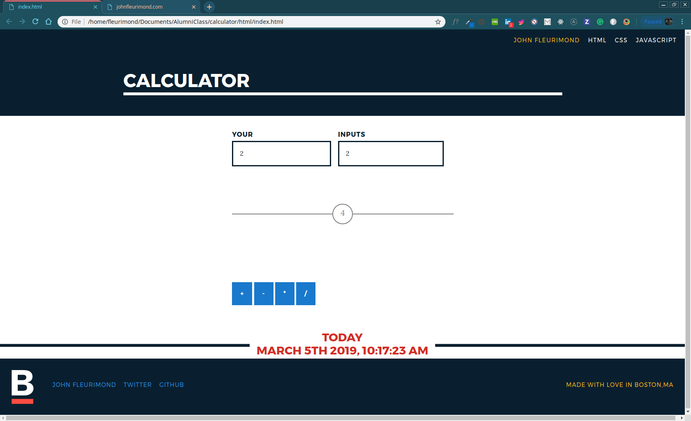

# My Awesome Project
This is a calculator I made last year to date. I was surprised how I didn't still it back then but came back to understand the basics of Javascript.

# How It's Made:

## CSS~
This application is made with Pattern fleet library which made styling more easy, I used flex box to move the indivdual elements by itself. I had a code challenge last week for a job and saw what I lacked in, which was time effeciency. I was just taking to long to write the code. Dealing with the box model in css, after leaving the Resilient coders bootcamp, I got real aquianted with Bootstrap/Pattern Fleet library for City of Boston. They had their own styling guide so I didnt have to worry about the style just had to worry about the functionality of the comonents in React and what were the data types I was dealing with.

## Javascript~
I notice dealing with React.js, I had issues dealing with onChange and onClick, It was back to basics. So with this application. `document.getElementById("plus").onclick = add` is listening for `<input class="btn " type="button" id="plus" name="plus" value="+" />` once that is pressed it will fire off a function I setup called `add()`to listen for the user `.onclick = add` type two numbers and select a operator which has the values of the input. 

```
function add() {
  //get value out of inputs
  var num1 = parseFloat(document.getElementById("firstVal").value)
  var num2 = parseFloat(document.getElementById("secondVal").value)

  var sum = num1 + num2
  //user sees result
  //display

  document.getElementById("result").innerHTML = sum

  document.getElementById("firstVal").innerHTML = ""
  document.getElementById("secondVal").innerHTML = ""
}

```

## Optimizations.


## Lessons Learned:

## portfolio:

**WEBSITE:** https:/johnfleurimond.com

## Installation

1. Clone repo
2. run `npm install`

## Usage

1. Right click on the `index.html` file in the folder and then right click and select the `Open in Browser` button.
